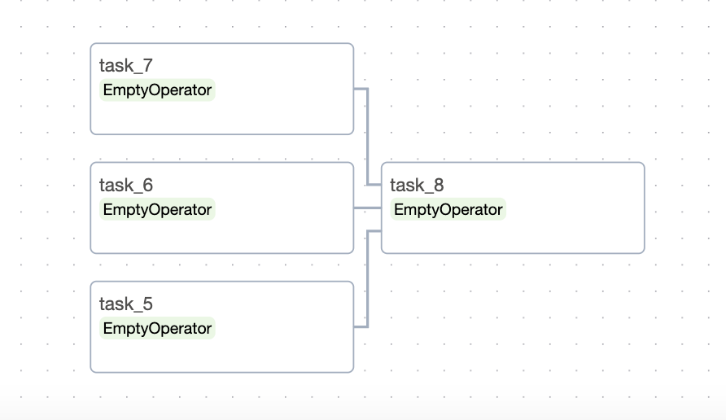
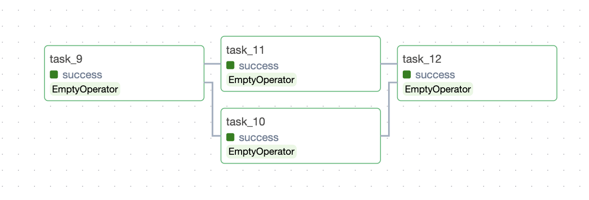

# Lesson 9 - Writing and Scheduling Airflow DAGs 

In this lab, you will be:
- Triggering a dbt Cloud Job using Airflow
- Writing and scheduling a DAG with dummy operators

## 1. Trigger a dbt Cloud Job with Airflow

1. Navigate to dbt Cloud and create a new Cloud Job named `Airflow Test Job`:
- **Execution settings:** Add `dbt run` under "Commands".
- **Triggers**: Ensure that the toggle is off (do not run the job on schedule).
- **Advanced settings:** Change `Target Name` to `prod`.

2. Navigate to your MWAA environment and click on "Open Airflow UI". Go to "Admin > Connections", and create a new Connection named `dbt_cloud`.
- **Connection Type:** Search for "dbt Cloud".
- **Account ID:** You can find this information by clicking on "API trigger" at the top right corner of your dbt Cloud job.
- **API Token:** Input the API token obtained from the service token.

3. Create a new Python file named `test_dbt_cloud.py` and copy the code below:

```
from datetime import datetime
from airflow.models import DAG
from airflow.providers.dbt.cloud.operators.dbt import DbtCloudRunJobOperator

# Instantiate DAG
with DAG(
    dag_id="test_dbt_cloud",

    # REPLACE ACCOUNT_ID
    default_args={"dbt_cloud_conn_id": "dbt_cloud", "account_id": ???},
    
    start_date=datetime(2021, 1, 1),
    schedule=None,
    catchup=False,
    tags=['dbt']
):
    trigger_dbt_cloud_job_run = DbtCloudRunJobOperator(
        task_id="trigger_dbt_cloud_job_run",
        
        # REPLACE JOB_ID
        job_id=???
    )

    trigger_dbt_cloud_job_run
```

[Documentation on DbtCloudRunJobOperator](https://airflow.apache.org/docs/apache-airflow-providers-dbt-cloud/stable/_api/airflow/providers/dbt/cloud/operators/dbt/index.html#airflow.providers.dbt.cloud.operators.dbt.DbtCloudRunJobOperatorLink)

4. Replace `account_id` with your dbt Cloud account ID. 

5. Save the changes in `test_dbt_cloud.py`, and upload it into the S3 bucket used for the training session. 

6. Manually Trigger a DAG run from the Airflow UI. You should be able to click into the dbt Cloud UI by clicking on the Task in the Graph view. 

## 2. Create your first DAG

1. Create a new Python file named `<your name> _test_active_dag.py` and copy the code below to create your first DAG:

```
from datetime import datetime, timedelta
from airflow.models import DAG
from airflow.operators.dummy import DummyOperator

with DAG(

    # UPDATE DAG_ID WITH <YOUR NAME>_TEST_DAG_ACTIVE
    dag_id="<your name>_test_dag_active",

    start_date=datetime(2024, 1, 1),
    schedule=timedelta(minutes=1),
    catchup=False,
    tags=['test']
) as dag_active:
    task_1 = DummyOperator(task_id="task_1")
    task_2 = DummyOperator(task_id="task_2")
    task_3 = DummyOperator(task_id="task_3")
    task_4 = DummyOperator(task_id="task_4")

# INSTANTIATE TASKS BELOW
```

2. Configure `dag_id` with the following format: `<your name>_test_dag_active`

3. `<your name>_test_dag_active` has 4 tasks that is scheduled to **run every 1 minute**. Instantiate tasks 1, 2, 3 & 4 using Bitshift operators to produce the following dependencies:


4. Copy and paste the following into the bottom of your Python file:

```
with DAG(
    # UPDATE DAG_ID WITH <YOUR NAME>_TEST_DAG_INACTIVE
    dag_id="<your name>_test_dag_inactive",

    start_date=datetime(2024, 1, 1),
    schedule=timedelta(minutes=1),
    catchup=False,
    tags=['test']
) as dag_inactive:
    task_5 = DummyOperator(task_id="task_5")
    task_6 = DummyOperator(task_id="task_6")
    task_7 = DummyOperator(task_id="task_7")
    task_8 = DummyOperator(task_id="task_8")

    # INSTANTIATE TASKS BELOW
```

5. `<your name>_test_dag_inactive` also has 4 tasks scheduled to **run every 1 minute** as well. This time, instantiate tasks 5, 6, 7 & 8 using Bitshift operators to produce the following dependencies:


4. Save the changes in `<your name> _test_active_dag.py`, and upload it into the S3 bucket used for the training session. 

## 3. Compare Active vs Paused DAGs

1. Navigate to the Airflow UI and click on "DAGs". You should see the DAGs you have created earlier:
- `<your name>_test_dag_active`
- `<your name>_test_dag_inactive`

2. Click on each of them and check the DAG in the "Graph" view. It should match the screenshots indicated in Steps 3 and 5 above.

3. Go back to "DAGs", and unpause `<your name>_test_dag_active` by clicking on the toggle. **Do not unpause `<your name>_test_dag_inactive`** as we will be comparing it with `<your name>_test_dag_active` in the next step.

4. Wait a few minutes, and compare the "Runs" column of both DAGs.
- Although the schedule for both DAGs are the same, no runs are scheduled for `<your name>_test_dag_inactive` as it is paused.
- On the other hand, `<your name>_test_dag_active` should have a run triggered for every minute that has passed since it was unpaused.

## 4. Understanding the `catchup` parameter

1. Create another Python file named `<your name> _test_active_catchup.py` and copy the code below:

```
from datetime import datetime, timedelta
from airflow.models import DAG
from airflow.operators.dummy import DummyOperator

with DAG(
    # UPDATE DAG_ID WITH <YOUR NAME>_TEST_DAG_CATCHUP
    dag_id="<your name>_test_dag_catchup",

    start_date=datetime(2024, 1, 1),
    schedule='@monthly',
    
    catchup=True,
    tags=['test']
) as dag_catchup:
    task_9 = DummyOperator(task_id="task_9")
    task_10 = DummyOperator(task_id="task_10")
    task_11 = DummyOperator(task_id="task_11")
    task_12 = DummyOperator(task_id="task_12")

    # INSTANTIATE TASKS BELOW
```

2. Configure `dag_id` with the following format: `<your name>_test_dag_catchup`.

3. `<your name>_test_dag_catchup` has 4 tasks that is scheduled to run every month. Instantiate tasks 9, 10, 11 & 12 using Bitshift operators to produce the following dependencies:


4. Save the changes in `<your name> _test_active_catchup.py`, and upload it into the S3 bucket used for the training session. 

5. Navigate to the Airflow UI, and unpause `<your name>_test_dag_catchup`.

6. Click into the Grid view of `<your name>_test_dag_catchup`, and observe the runs that have been triggered:
- This DAG has been configured with `catchup=True`
- Airflow automatically creates runs for the historical time period between `start_time` (i.e. 1 Jan 2024) and now.
- As the DAG is configured to run **monthly**, you should see 3 runs created for **each month that have passed since 1 Jan 2024.**

